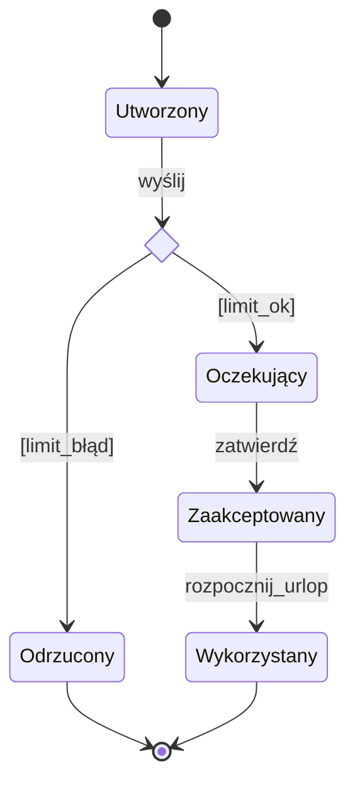

```mermaid
stateDiagram-v2
    [*] --> Utworzony
    
    state weryfikacja <<choice>>
    Utworzony --> weryfikacja : wyślij
    
    weryfikacja --> Oczekujący : [limit_ok]
    weryfikacja --> Odrzucony : [limit_błąd]
    
    Oczekujący --> Zaakceptowany : zatwierdź
    Zaakceptowany --> Wykorzystany : rozpocznij_urlop
    
    Odrzucony --> [*]
    Wykorzystany --> [*]
```

